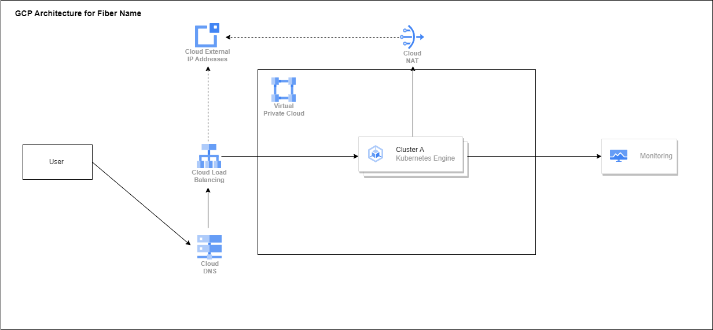

# Fiber Name Infrastructure
Fiber Name infrastructure is to build infrastructure for api fiber-name

### Requirement on GCP :
- GKE => infrastructure for running service api fiber-name 
- Load Balancer => Inbound Connection  (Ingress in GKE by default will atttach to a Load Balancer)
- Cloud NAT => Connection Outbound
- External IP Address static for load balancer and Cloud NAT 
- Cloud Monitoring => For monitoring resource GKE  
